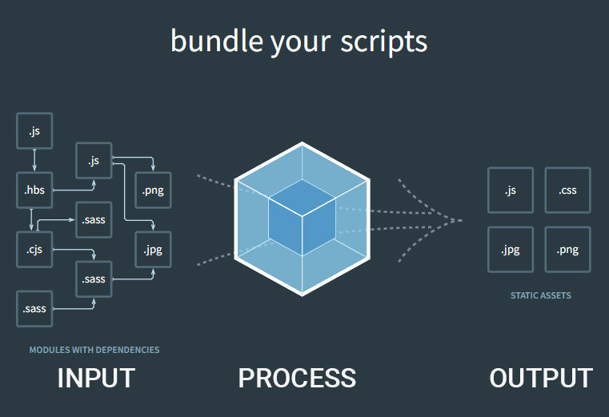

<br>

## 1. 웹팩을 실행하기 위한 설정

{: .img-width-half}

앞선 방법으로 CLI에 명령어를 입력해 웹팩을 실행시킬수도 있지만   
웹팩실행의 재사용성을 위해 config.js파일에 작성하여 실행시킬수도 있다.

작성방법은 공식홈페이지에서 
DOCUMENTATION → configuration 에서 확인할수 있다.
<a href="https://webpack.js.org/configuration/" target="_blank">웹팩 config.js 문서</a>


option을 클릭해 보면 config.js작성 예시를 볼수 있다.


## 2. webpack.config.js 파일작성
```javascript
const path = require('path');
/*
node.js에서 파일을 쉽게 핸들링할수 있게 도와주는 일종의 부품 이걸 설정해줘야 path를 사용할수 있다. 
ex) path: path.resolve()
*/

module.exports = {
    entry: "./source/index.js",
    output: {
        path: path.resolve(__dirname, "public"),
        /*
        path: path.resolve(__dirname, "dist")
        __dirname은 webpack.config.js파일이 위치하고 있는 경로를 알려주는 node.js의 약속된 변수 
        그리고 그 경로에 dist라고 하는 하위 경로의 최종적인 결과물의 폴더 경로
        */
        
        filename: "index_bundle.js"
        /* 
        최종결과물의 파일이름
        filename: "[name].js"
        */
    }
    //npx wabpack --entry ./source/index.js --output-path ./public/ output-filename index_bundle.js와 같음
}
```

위와같이 작성후 아래 명령어를 실행해주면 public폴더와 index_bundle.js파일이 생성된다.
```bash
npx webpack --config webpack.config.js
```

webpack.config.js는 약속된 파일이기때문에 webpack만 작성하여도 웹팩이 config파일을 찾아내어 실행한다
```bash
npx webpack
```
